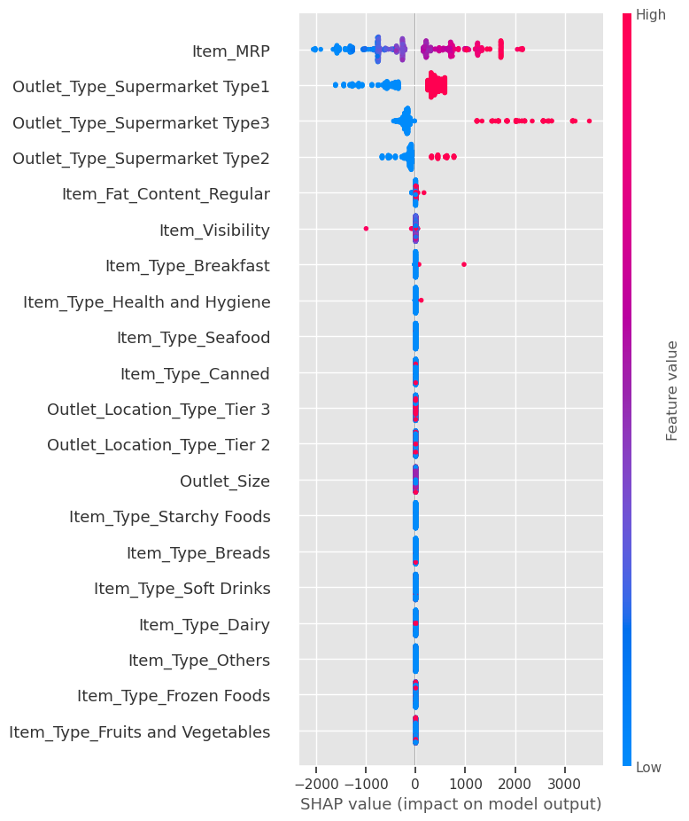

# Food Sales Prediction
- Author: Shehani Wetthasinghe
- Last modified: 01/26/2023

## Overview

The goal of this project is to to predict the sales based on the features of food products and the outlets. 

The following table illustrated the features and their data types given in the original data source.

**Note:** Indian Rupee (₹) is used as the currency of this data set. 

### Data Types
| Column Name               | Data Type      | Description                                                                                           |
| -------------             | -------------  |-------------------------------------------------------------------------------------------------------|
| Item_Identifier           | object         | Unique product ID                                                                                     | 
| Item_Weight               | float          | Weight of product                                                                                     |
| Item_Fat_Content          | object         | Whether the product is low fat or regular                                                             |  
| Item_Visibility           | float          | The percentage of total display area of all products in a store allocated to the particular product   |
| Item_Type                 | object         | The category to which the product belongs                                                             |
| Item_MRP                  | float          | Maximum Retail Price (list price) of the product                                                      |
| Outlet_Identifier         | object         | Unique store ID                                                                                       | 
| Outlet_Establishment_Year | int            | The year in which store was established                                                               |
| Outlet_Size               | object         | The size of the store in terms of ground area covered                                                 |
| Outlet_Location_Type      | object         | The type of area in which the store is located                                                        |
| Outlet_Type               | object         | Whether the outlet is a grocery store or some sort of supermarket                                     |
| Item_Outlet_Sales         | float          | Sales of the product in the particular store. This is the target variable to be predicted             |

We can maximize the future sales by exploring the key features that directly affect to the sales.

## Data Analysis and Visualization
The below pie chart will give you an idea about the proptions of different outlet types used in the data set. Supermarket type1 shows the major contribution.

Below histrogram tells the distribution of market retail prices for products available in all outlets. The items appproximately above ₹ 200 MRP is lower comparative to MRP below 200. The maximum number of items are in between ~ ₹ 120 and ~ ₹ 130 MRP

The following histrogram shows the distribution of total sales for each product in a particular outlet. Since it is a right skewed distribution, the low priced products tend to have more demand comaprative to the procducts with high prices.

According to the following diagram, the range of sales for different outlet types can be arranged as;

Supermarket type3 > Supermarket type1 > Supermarket type3 > Grocery

Let's look at the total sales for each product category. 

- Out of all product categories, fruits and vegetables has the highest sales while seafood has the lowest from all types of outlets.

The above diagrom illustrates the total sales as percentage values when it catergorized according to fat content, outlet type and outlet size. The maximum sales obtained from;

- items contain with low fat according to subplot 1
- supermarket type 1 according to subplot 2
- medium size outlets according to subplot 3

## Model Explainers

### Global Explianers 

#### Using coefficients of linear regression model
First, the importance of the features were determined by extracting the coefficients of linear regression model. The below figure illustrates the coefficent values for each features.

#### Using feature importance attribute of decision tree regression model
Next, the importance of the features were determined for decision tree regression model using ".feature_importances_" attribute and the values are shown in below.

According  to the both models, 'Item_MRP' and 'Outlet_Type' are the most impactful features in the data set. 

#### Using shap summary bar plot of decision tree regression model

- As the feature importance plot, SHAP determined that the most important features are 'Item_MRP', 'Outlet_Type_Supermarket Type1', 'Outlet_Type_Supermarket Type2' and 'Outlet_Type_Supermarket Type3'.
- The only differnce is the order of importance of type of the supermarket is difference in two methods.

#### Using shap summary dot plot of decision tree regression model

- Here Item_MRP is numerical feature while Outlet_Type features are generated by OneHotEncoder.
- According to the most important feature: Item_MRP;
    - Higher the Item_MRP higher the predicted sales value of the item
    - And it has a wide distribution
- According to the second most important feature: Outlet_Type_Supermarket Type1;   
    - If the item is in Type1 supermarket, the predicted sales value is higher
- According to the third most important feature: Outlet_Type_Supermarket Type3;   
    - If the item is in Type3 supermarket, the predicted sales value is higher 
    
### Local Explainers

According to Shap local explainers;
- Item_MRP and Outlet_Type_Supermarket Type3 features make a large contribution to increase the predicted sales while Outlet_Type_Supermarket Type 1 feature makes a comparably small impact to decrease the predicted sales to its maximum value
- Item_MRP and Outlet_Type_Supermarket Type1, Outlet_Type_Supermarket Type2 and Outlet_Type_Supermarket Type3 features impact to decrease the predicted sales to its minimum value

According to the Lime explainer;
- Outlet_Type_Supermarket Type3 and Item_MRP increase the predicted sales while Outlet_Type_Supermarket Type1 and Outlet_Type_Supermarket Type2 decrease the predicted sales to its maximum value. 
- Outlet_Type_Supermarket Type3, Outlet_Type_Supermarket Type1, Item_MRP and Outlet_Type_Supermarket Type2 decrease predicted value while Item_Type_Seafood, Item_Type_Meat and Item_Fat_Content_Regular increase the predicted sales to its minimum value.

## Recommendations

- According to this data analysis, customers tend to purchase more healthier food comparative to other food categories. Therefore, I suggest to increase the stock of low fat items in medium sized supermarket type 1s to maximize the sales comparative to other outlets

According to the above plot, the minimum amount of sales occurred in grocery stores through all the range of MRP values.

## Make Predictions
Here, I came up with two types of machine learning models to predict the food sales in different outlets. They are;

- Linear Regression
- Decision Tree 

The performance of the ML models are as follows;

|Model|Train R2|Test R2|Train RMSE|Test RMSE|
|---|---|---|---|---|
|Linear Regression|0\.560571|0\.565842|₹1140\.38|₹1094\.46|
|Decision Tree    |0\.603933|0\.594709|₹1082\.66|₹1057\.44|

- Here I conclude that the decision tree model is the best performing model since it obtained;
    - highest test R2 score
    - lowest train and test RMSE values
    - lowest diffrence value between train and test RMSE

